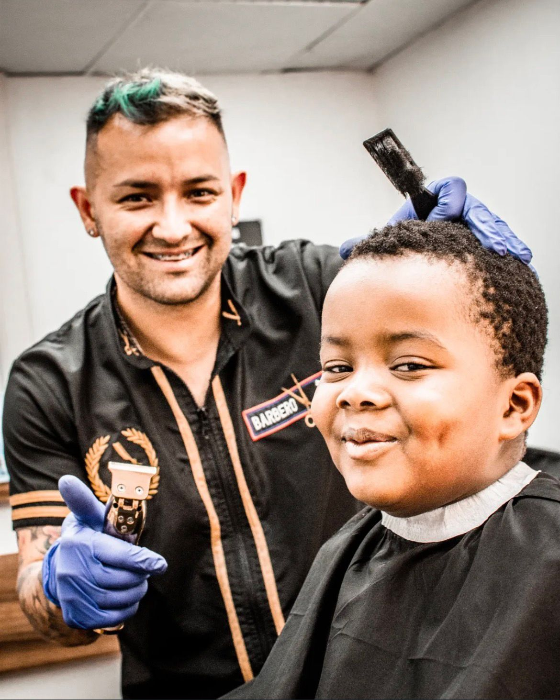
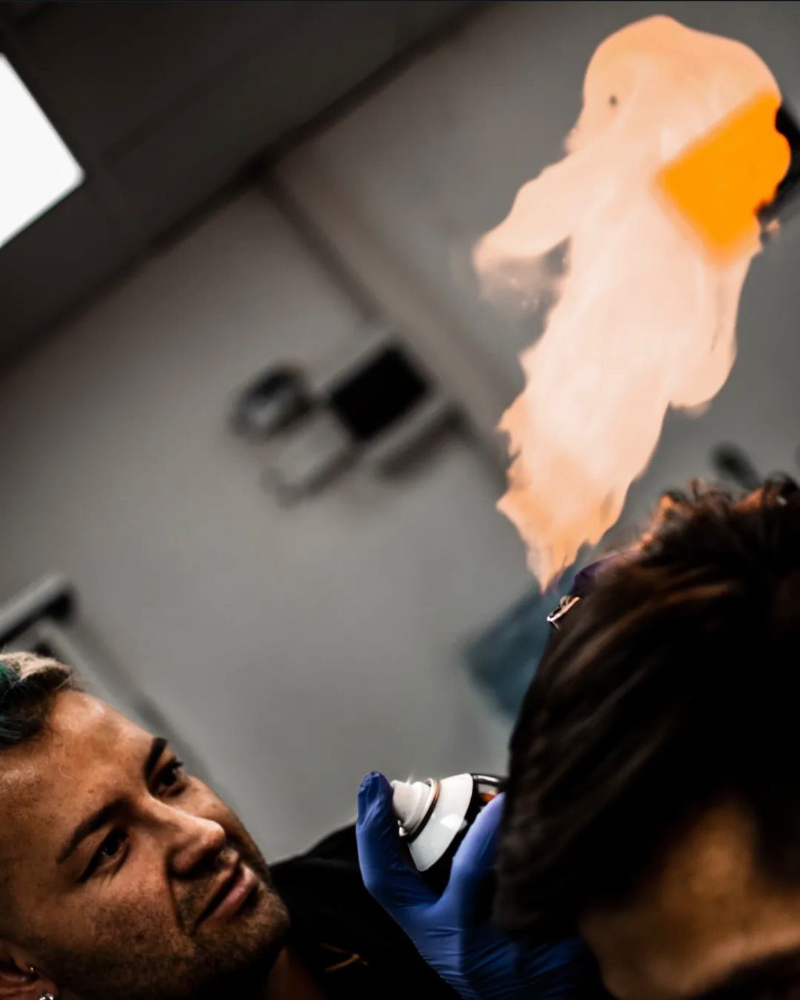
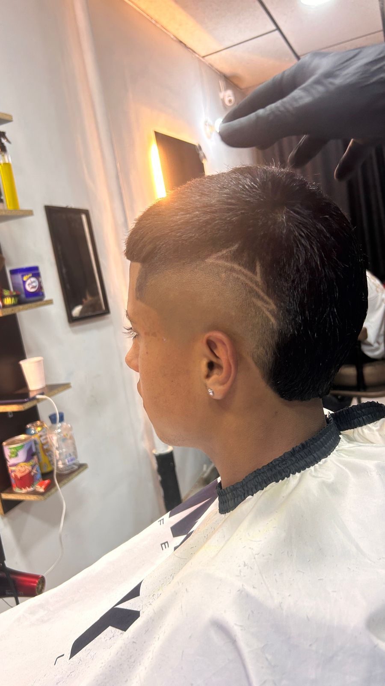

<!DOCTYPE html>
<html lang="es">
<head>
<meta charset="UTF-8">
<meta name="viewport" content="width=device-width, initial-scale=1.0">

<title>Jonocampo77 Barbería</title>

</head>

<body>

<header>

    <!-- Cambia logo.png por el nombre de tu logo -->
    

    <h1>JONOCAMPO77</h1>

    

        Barbería Profesional
    

</header>

    <button onclick="mostrar('inicio')">
        Inicio
    </button>

    <button onclick="mostrar('sobre')">
        Sobre mí
    </button>

    <button onclick="mostrar('galeria')">
        Galería
    </button>

    <button onclick="mostrar('contacto')">
        Contacto
    </button>

    <h2>Bienvenido</h2>

    

        Bienvenido a Jonocampo77 Barbería.
        Estilo, experiencia y calidad en cada corte.
    

    <a
        href="https://www.instagram.com/jonocampo77?igsh=aHo0bGN3aGdsOW1y"
        target="_blank"
        class="btn">

        Ver Instagram

    </a>

    <h2>Sobre mí</h2>

    

        Soy barbero profesional con más de 15 años de experiencia.
        Especialista en cortes modernos, clásicos y arreglo de barba.

        No vendemos un corte, vendemos una experiencia.
    

    <h2>Galería</h2>

    

    

       

    

    

    

    

    

    

     

    

    
    

    <h2>Contacto</h2>

    

        Agenda tu cita por WhatsApp.
    

    <a
        href="https://wa.me/573207440896"
        target="_blank"
        class="btn">

        +57 320 744 0896

    </a>

<footer>

    © 2026 Jonocampo77 Barbería

</footer>

</body>
</html>
